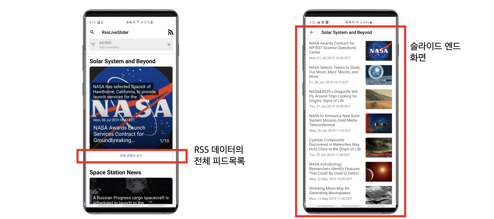

# RssLiveSlider
RssLiveSlider android app
2019 여름 D2Campus Fest Mini 참가를 위한 앱.
참가 주제 : 6. 라이브 슬라이더 안드로이드 앱 만들기 

## 수상
</img>
2019 여름 D2Campus Fest Mini에서 최우수상을 수상했습니다.

## 데이터 모델링
tikxml 라이브러리를 사용해 xml 데이터 파싱한다.

## Slide View 및 Live Animation
</img>   
각각의 RSS 데이터를 보여주는 Vertical RecyclerView의 아이템들을   
프래그먼트로 구성하여 확장성이 용이하다.  
   
현재 사용자에게 보여지는 RSS 데이터만 자동재생이 되고,   
보이지 않는 RSS 데이터는 재생을 안하거나 멈춘다.  
이미지 스케일 애니메이션과 텍스트 애니메이션을 적용했다.    
   
사용자가 직접 슬라이드를 넘기면 자동 재생을 멈춘다.  
   
슬라이드가 다시 포커스되면 이전에 보던 피드부터 자동 재생 및 애니메이션이 다시 시작된다.  
   
피드에 동영상이 포함되어 있다면 자동 재생되고, 로딩 시간이 있다면 썸네일을 띄워준다.

## RSS 데이터 구독
  
사용자가 직접 RSS url을 추가하면 슬라이더 뷰로 보여준다.

## 검색
  
제목과 이미지 내의 객체 정보로 검색 결과 목록을 보여준다.

## 필터
  
RSS 목록과 정렬 방법로 필터링한 결과 목록을 슬라이더 뷰로 보여준다.

## 슬라이드 엔드 화면
   
RSS 데이터의 전체 피드 목록을 볼 수 있다.

전체 피드 목록 및 슬라이드에서 선택한 피드의 전체 컨텐츠를 보여준다.  
공유 및 해당 웹사이트 연결이 가능하다.

## 최적화
빠른 데이터 처리를 위해 tikxml 라이브러리 사용     
데이터 모델링 최적화를 위해 불필요한 계층구조를 제거   
속도, 편의성, 가독성이 좋은 네트워크 통신을 위해 Retrofit 사용   
현재 보여지는 RSS 데이터에만 슬라이더 자동재생 및 Live Animation을 적용해 최적화  
RxJava를 사용해 이벤트를 간단하게 처리하고 불필요한 이벤트 발생 방지   
유의미한 데이터 제공을 위해 불필요한 html 태그 제거 등을 통한 데이터 최적화   
RxJava를 사용해 코드의 가독성을 높이고 다양한 쓰레드 관리가 가능   

## Installation
Clone this repository and import into **Android Studio**
```bash
git clone https://github.com/ahndwon/RssLiveSlider.git
```


## Maintainers
This project is mantained by:
* [Dongwon Ahn](https://github.com/ahndwon)
* [Hanna Jang](https://github.com/hannaS2)
* [eunjeong](https://github.com/eunjeongS2)


## Contributing

1. Fork it
2. Create your feature branch (git checkout -b my-new-feature)
3. Commit your changes (git commit -m 'Add some feature')
4. Run the linter (ruby lint.rb').
5. Push your branch (git push origin my-new-feature)
6. Create a new Pull Request

## License
Please see [LICENSE](./LICENSE)


